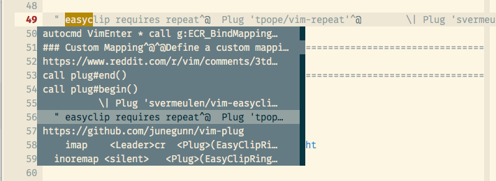

# EasyClipRing.vim v1.2.1

Autocomplete style vim pop-up menu for your registers. See screenshot in
the [Usage](#usage) section.

This plugin requires [vim-easyclip](https://github.com/svermeulen/vim-easyclip)
which requires [vim-repeat](https://github.com/tpope/vim-repeat)

## Installation

You can just drop this plugin into your `.vim/` dir. Make sure vim-repeat and
vim-easyclip are also installed.

I recommend using [vim-plug](https://github.com/junegunn/vim-plug) in general:

    call plug#begin()

    Plug 'tpope/vim-repeat'
          \| Plug 'svermeulen/vim-easyclip'
          \| Plug 'davidosomething/EasyClipRing.vim'

    call plug#end()

Note the dependency scaffold there -- vim-easyclip integrates with vim-repeat,
and EasyClipRing.vim uses vim-easyclip.

## Usage

Define a custom mapping like so:

    imap    gcr  <Plug>(EasyClipRing)

or for `<Ctrl-L>`

    imap    <C-l>   <Plug>(EasyClipRing)

Use it in in __insert__ mode to trigger the pop-up menu:

## Thanks

- /u/rgvim on [reddit](https://www.reddit.com/r/vim/comments/3td6l6/can_someone_help_with_this_easyclip_yanks_in_a/)
who really helped with the formatting!

- [Steve Vermeulen](https://github.com/svermeulen/) for creating easyclip

## Changelog

- 1.2.1
    - Remove set encoding from plugin file

- 1.2.0
    - Fix mappings and restructure plugin.

- 1.1.0
    - Remove default mapping altogether, especially since it makes it hard to
    type words starting with `cr` like `create`, etc.

- 1.0.0
    - Initial version

## License

MIT

